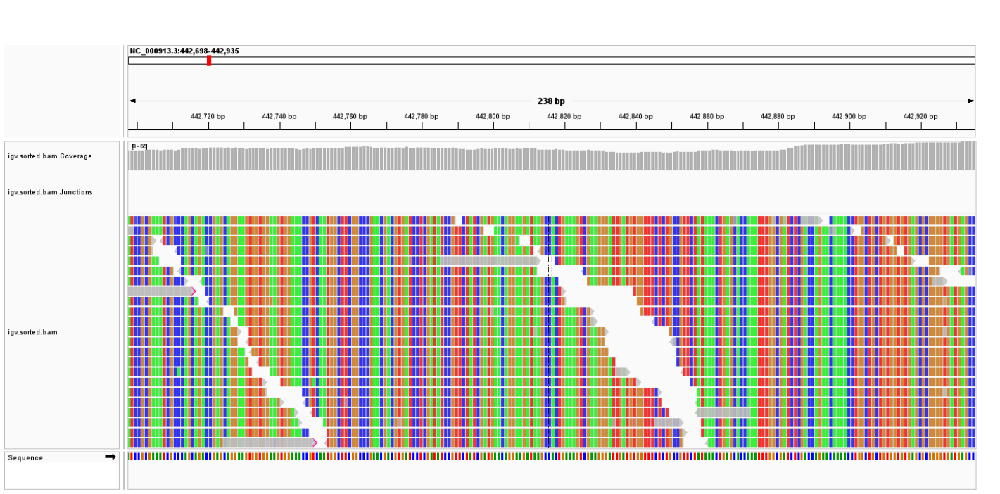

<!-- Improved compatibility of back to top link: See: https://github.com/othneildrew/Best-README-Template/pull/73 -->

<!-- PROJECT LOGO -->
 

<h3 align="center">Read mapping and genome assembly 🧬</h3>

  

    Department of Bioinformatics, IBB, University of Tehran
     
  

  

<!-- TABLE OF CONTENTS -->

  
Table of Contents

  <ol>
    <li>
      <a href="#about-the-project">Part A - Downloading and Analyzing and Quality Control of E. Coli WGS Data</a>
      <ul>
        <li><a href="#built-with">Built With</a></li>
      </ul>
    </li>
    <li>
      <a href="#about-the-project">Part B - Denovo Genome Assembly</a>
      <ul>
        <li><a href="#built-with">Built With</a></li>
      </ul>
    </li>
	<li>
      <a href="#about-the-project">Part C - Mapping & variant calling</a>
      <ul>
        <li><a href="#built-with">Built With</a></li>
      </ul>
    </li>
  </ol>

<!-- ABOUT THE PROJECT -->
## ROADMAP

This project aims to develop proficiency in handling short-read and long-read genomic data, performing quality control, creating genome assemblies, and conducting read mapping and variant calling. In this project, you will learn
